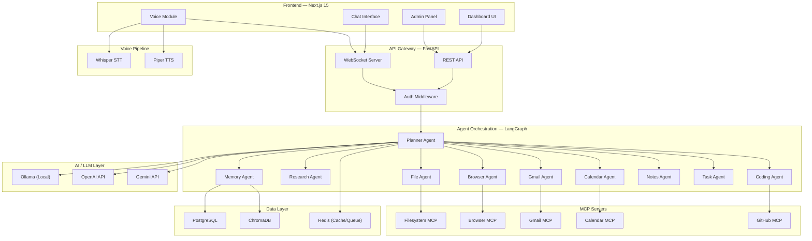
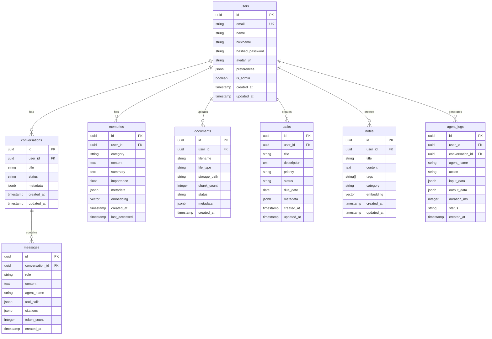
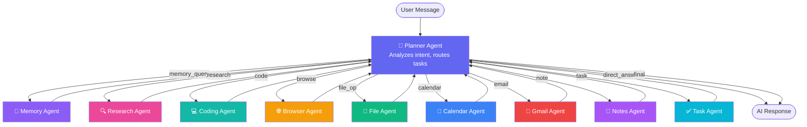
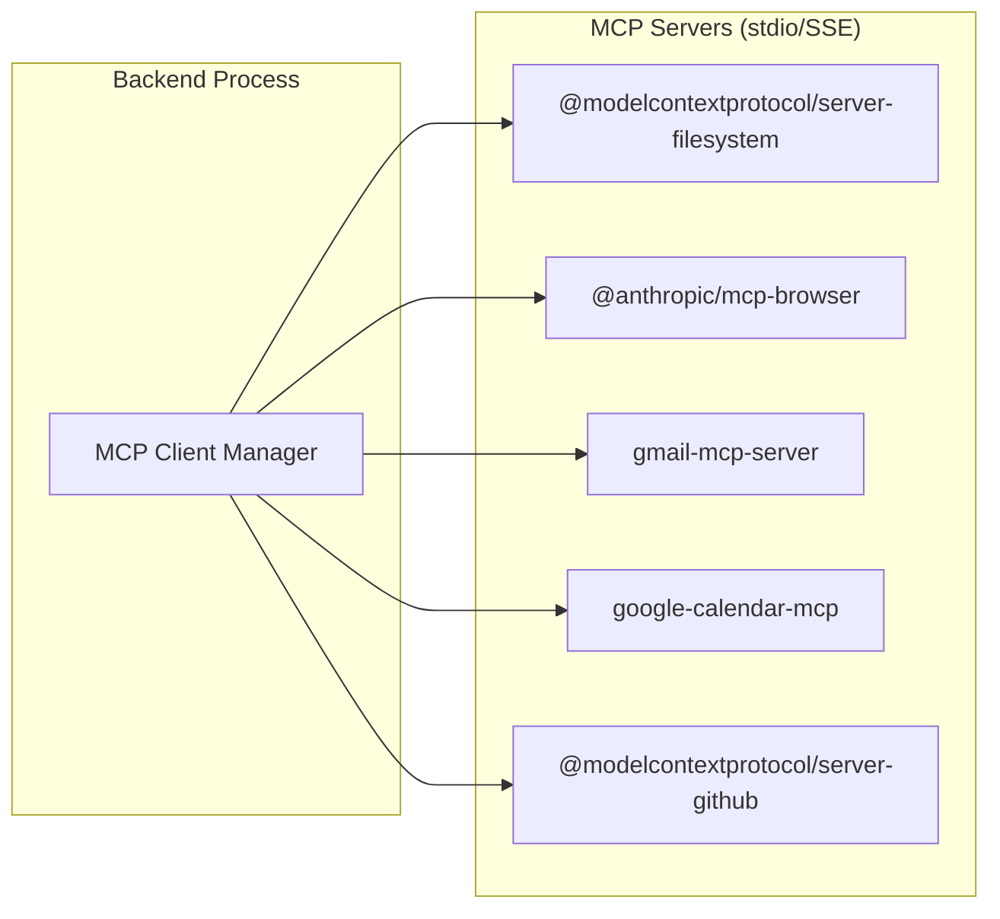

# Nidhi — Personal AI Operating System

## Overview

**Nidhi** is a production-grade Personal AI Operating System that combines conversational AI, long-term memory, multi-agent orchestration, RAG, voice interaction, and productivity integrations (Gmail, Calendar, Notes, Tasks, Files) into a single cohesive platform.

---

## System Architecture



---

## Folder Structure

```
d:\Personal AI Assistent(Nidhi)\
├── frontend/                      # Next.js 15 App
│   ├── app/                       # App Router
│   │   ├── (auth)/                # Auth routes
│   │   │   ├── login/page.tsx
│   │   │   └── register/page.tsx
│   │   ├── (dashboard)/           # Main dashboard
│   │   │   ├── layout.tsx
│   │   │   ├── page.tsx           # Dashboard home
│   │   │   ├── chat/page.tsx
│   │   │   ├── memory/page.tsx
│   │   │   ├── files/page.tsx
│   │   │   ├── research/page.tsx
│   │   │   ├── tasks/page.tsx
│   │   │   ├── calendar/page.tsx
│   │   │   ├── gmail/page.tsx
│   │   │   ├── notes/page.tsx
│   │   │   └── settings/page.tsx
│   │   ├── (admin)/               # Admin panel
│   │   │   ├── layout.tsx
│   │   │   ├── page.tsx
│   │   │   ├── memories/page.tsx
│   │   │   ├── agents/page.tsx
│   │   │   ├── logs/page.tsx
│   │   │   └── analytics/page.tsx
│   │   ├── api/                   # API routes (NextAuth, proxy)
│   │   │   └── auth/[...nextauth]/route.ts
│   │   ├── layout.tsx
│   │   └── globals.css
│   ├── components/
│   │   ├── ui/                    # Shadcn UI components
│   │   ├── chat/
│   │   │   ├── ChatWindow.tsx
│   │   │   ├── MessageBubble.tsx
│   │   │   ├── ChatInput.tsx
│   │   │   └── AgentThinking.tsx
│   │   ├── dashboard/
│   │   │   ├── Sidebar.tsx
│   │   │   ├── TopBar.tsx
│   │   │   ├── QuickActions.tsx
│   │   │   └── StatsCards.tsx
│   │   ├── memory/
│   │   ├── files/
│   │   ├── research/
│   │   ├── tasks/
│   │   ├── calendar/
│   │   ├── gmail/
│   │   ├── notes/
│   │   ├── voice/
│   │   │   ├── VoiceButton.tsx
│   │   │   ├── WaveformVisualizer.tsx
│   │   │   └── VoiceOverlay.tsx
│   │   └── admin/
│   ├── lib/
│   │   ├── api.ts                 # API client
│   │   ├── ws.ts                  # WebSocket client
│   │   ├── auth.ts                # NextAuth config
│   │   ├── utils.ts
│   │   └── stores/                # Zustand stores
│   │       ├── chatStore.ts
│   │       ├── memoryStore.ts
│   │       └── uiStore.ts
│   ├── hooks/
│   │   ├── useChat.ts
│   │   ├── useVoice.ts
│   │   ├── useWebSocket.ts
│   │   └── useMemory.ts
│   ├── types/
│   │   └── index.ts
│   ├── public/
│   ├── tailwind.config.ts
│   ├── next.config.ts
│   ├── tsconfig.json
│   └── package.json
│
├── backend/                       # FastAPI Backend
│   ├── app/
│   │   ├── main.py                # FastAPI app entry
│   │   ├── config.py              # Settings / env
│   │   ├── database.py            # DB connections
│   │   │
│   │   ├── api/                   # API layer
│   │   │   ├── __init__.py
│   │   │   ├── deps.py            # Dependencies
│   │   │   ├── routes/
│   │   │   │   ├── __init__.py
│   │   │   │   ├── chat.py
│   │   │   │   ├── memory.py
│   │   │   │   ├── files.py
│   │   │   │   ├── research.py
│   │   │   │   ├── tasks.py
│   │   │   │   ├── calendar.py
│   │   │   │   ├── gmail.py
│   │   │   │   ├── notes.py
│   │   │   │   ├── voice.py
│   │   │   │   ├── admin.py
│   │   │   │   └── auth.py
│   │   │   └── websocket.py       # WS handler
│   │   │
│   │   ├── agents/                # LangGraph agents
│   │   │   ├── __init__.py
│   │   │   ├── orchestrator.py    # Main LangGraph graph
│   │   │   ├── planner.py
│   │   │   ├── memory_agent.py
│   │   │   ├── research_agent.py
│   │   │   ├── coding_agent.py
│   │   │   ├── browser_agent.py
│   │   │   ├── file_agent.py
│   │   │   ├── calendar_agent.py
│   │   │   ├── gmail_agent.py
│   │   │   ├── notes_agent.py
│   │   │   ├── task_agent.py
│   │   │   └── tools/             # Agent tools
│   │   │       ├── __init__.py
│   │   │       ├── search_tools.py
│   │   │       ├── file_tools.py
│   │   │       ├── calendar_tools.py
│   │   │       ├── gmail_tools.py
│   │   │       ├── browser_tools.py
│   │   │       └── code_tools.py
│   │   │
│   │   ├── mcp/                   # MCP integration
│   │   │   ├── __init__.py
│   │   │   ├── client.py          # MCP client manager
│   │   │   ├── filesystem.py
│   │   │   ├── browser.py
│   │   │   ├── gmail.py
│   │   │   ├── calendar.py
│   │   │   └── github.py
│   │   │
│   │   ├── memory/                # Memory system
│   │   │   ├── __init__.py
│   │   │   ├── manager.py         # Memory lifecycle
│   │   │   ├── embeddings.py      # Embedding utils
│   │   │   ├── retriever.py       # Semantic retrieval
│   │   │   └── categorizer.py     # Auto-categorization
│   │   │
│   │   ├── rag/                   # RAG pipeline
│   │   │   ├── __init__.py
│   │   │   ├── ingest.py          # Document ingestion
│   │   │   ├── chunker.py         # Smart chunking
│   │   │   ├── retriever.py       # RAG retrieval
│   │   │   └── citation.py        # Citation tracking
│   │   │
│   │   ├── voice/                 # Voice pipeline
│   │   │   ├── __init__.py
│   │   │   ├── stt.py             # Whisper STT
│   │   │   ├── tts.py             # Piper TTS
│   │   │   └── wake_word.py       # "Hey Uday" detection
│   │   │
│   │   ├── llm/                   # LLM providers
│   │   │   ├── __init__.py
│   │   │   ├── provider.py        # Unified interface
│   │   │   ├── ollama.py
│   │   │   ├── openai.py
│   │   │   └── gemini.py
│   │   │
│   │   ├── models/                # SQLAlchemy models
│   │   │   ├── __init__.py
│   │   │   ├── user.py
│   │   │   ├── conversation.py
│   │   │   ├── memory.py
│   │   │   ├── document.py
│   │   │   ├── task.py
│   │   │   ├── note.py
│   │   │   └── agent_log.py
│   │   │
│   │   ├── schemas/               # Pydantic schemas
│   │   │   ├── __init__.py
│   │   │   ├── chat.py
│   │   │   ├── memory.py
│   │   │   ├── file.py
│   │   │   ├── task.py
│   │   │   ├── note.py
│   │   │   └── auth.py
│   │   │
│   │   └── services/              # Business logic
│   │       ├── __init__.py
│   │       ├── chat_service.py
│   │       ├── memory_service.py
│   │       ├── file_service.py
│   │       ├── task_service.py
│   │       ├── note_service.py
│   │       └── auth_service.py
│   │
│   ├── alembic/                   # DB migrations
│   │   ├── versions/
│   │   ├── env.py
│   │   └── alembic.ini
│   ├── tests/
│   ├── requirements.txt
│   ├── Dockerfile
│   └── pyproject.toml
│
├── mcp-servers/                   # MCP server configs
│   ├── filesystem/
│   ├── browser/
│   ├── gmail/
│   ├── calendar/
│   └── github/
│
├── docker/
│   ├── docker-compose.yml
│   ├── docker-compose.dev.yml
│   ├── nginx/
│   │   └── nginx.conf
│   └── .env.example
│
├── docs/
│   ├── architecture.md
│   ├── api.md
│   └── deployment.md
│
├── scripts/
│   ├── setup.sh
│   ├── seed_db.py
│   └── start_dev.sh
│
├── .env.example
├── .gitignore
├── README.md
└── Makefile
```

---

## Database Schema



### ChromaDB Collections

| Collection | Purpose | Embedding Model |
|---|---|---|
| `user_memories` | Long-term memory embeddings | `all-MiniLM-L6-v2` |
| `document_chunks` | RAG document chunks | `all-MiniLM-L6-v2` |
| `note_embeddings` | Note semantic search | `all-MiniLM-L6-v2` |
| `conversation_history` | Past conversation retrieval | `all-MiniLM-L6-v2` |

---

## LangGraph Agent Architecture



### Orchestration Flow

The **Planner Agent** is the brain. It:
1. Receives user message + conversation history + relevant memories
2. Classifies intent (can be multi-intent)
3. Creates an execution plan (ordered list of agent calls)
4. Dispatches to sub-agents (may run in parallel where possible)
5. Aggregates results
6. Generates final response
7. Triggers memory storage for important information

### LangGraph State Schema

```python
class AgentState(TypedDict):
    messages: Annotated[list[BaseMessage], add_messages]
    user_id: str
    conversation_id: str
    plan: list[dict]               # Execution plan from planner
    current_step: int
    agent_results: dict[str, Any]  # Results from sub-agents
    memories: list[dict]           # Retrieved memories
    final_response: str
    tool_calls_log: list[dict]
    error: Optional[str]
```

---

## MCP Architecture



Each MCP server runs as a subprocess managed by the backend. The `MCPClient` class provides a unified interface for agents to call MCP tools.

---

## API Design

### REST Endpoints

| Method | Path | Description |
|--------|------|-------------|
| `POST` | `/api/v1/auth/register` | Register user |
| `POST` | `/api/v1/auth/login` | Login |
| `GET` | `/api/v1/auth/me` | Current user |
| `GET` | `/api/v1/conversations` | List conversations |
| `POST` | `/api/v1/conversations` | Create conversation |
| `GET` | `/api/v1/conversations/{id}` | Get conversation |
| `DELETE` | `/api/v1/conversations/{id}` | Delete conversation |
| `POST` | `/api/v1/chat` | Send message (non-streaming) |
| `GET` | `/api/v1/memories` | List memories |
| `POST` | `/api/v1/memories/search` | Semantic search memories |
| `DELETE` | `/api/v1/memories/{id}` | Delete memory |
| `POST` | `/api/v1/files/upload` | Upload document for RAG |
| `GET` | `/api/v1/files` | List uploaded files |
| `DELETE` | `/api/v1/files/{id}` | Delete file |
| `POST` | `/api/v1/files/{id}/query` | Query a document |
| `GET` | `/api/v1/tasks` | List tasks |
| `POST` | `/api/v1/tasks` | Create task |
| `PATCH` | `/api/v1/tasks/{id}` | Update task |
| `DELETE` | `/api/v1/tasks/{id}` | Delete task |
| `GET` | `/api/v1/notes` | List notes |
| `POST` | `/api/v1/notes` | Create note |
| `PATCH` | `/api/v1/notes/{id}` | Update note |
| `DELETE` | `/api/v1/notes/{id}` | Delete note |
| `POST` | `/api/v1/notes/search` | Search notes |
| `POST` | `/api/v1/voice/stt` | Speech-to-text |
| `POST` | `/api/v1/voice/tts` | Text-to-speech |
| `GET` | `/api/v1/admin/logs` | Agent logs |
| `GET` | `/api/v1/admin/analytics` | Analytics data |
| `GET` | `/api/v1/admin/agents` | Agent status |

### WebSocket

| Path | Description |
|------|-------------|
| `ws://host/ws/chat/{conversation_id}` | Streaming chat (real-time tokens + agent status) |
| `ws://host/ws/voice` | Real-time voice stream |

---

## User Review Required

> [!IMPORTANT]
> **LLM Provider Priority**: The plan defaults to **Ollama (local)** as primary with OpenAI/Gemini as optional cloud fallbacks. If you want cloud-first (OpenAI/Gemini as default), let me know.

> [!IMPORTANT]
> **Authentication Scope**: The plan uses **NextAuth with credential-based auth** (email/password). If you want Google OAuth, GitHub OAuth, or other social logins, please specify.

> [!WARNING]
> **Google API Credentials Required**: Calendar and Gmail agents need a Google Cloud project with OAuth 2.0 credentials. The code will include placeholder configuration — you will need to supply your own `client_id` and `client_secret`.

> [!WARNING]
> **Hardware Requirements for Local LLMs**: Running Ollama with Llama 3 / Qwen / Gemma locally requires at minimum 16GB RAM and ideally a GPU with 8GB+ VRAM. Whisper STT also benefits from GPU acceleration.

---

## Open Questions

> [!IMPORTANT]
> 1. **Which Ollama model should be the default?** Llama 3 8B (faster, less capable) vs. Qwen 2.5 14B (slower, more capable)?
> 2. **Do you want real Google Calendar/Gmail integration now**, or should those agents initially be mocked/simulated for development?
> 3. **User scope**: Is this single-user (just you) or multi-user? This affects auth complexity significantly.
> 4. **Wake word "Hey Uday"**: Should this work only in the browser tab, or do you want a system-wide desktop wake word listener?

---

## Proposed Changes — Phased Implementation

### Phase 1: Foundation (Backend Core + DB + Auth)

> Sets up the entire backend skeleton, database, config, and auth so every subsequent phase builds on solid ground.

#### [NEW] `backend/app/main.py`
FastAPI app factory with CORS, middleware, lifespan, router registration.

#### [NEW] `backend/app/config.py`
Pydantic Settings for all env vars (DB URL, API keys, MCP paths, LLM config).

#### [NEW] `backend/app/database.py`
Async SQLAlchemy engine + session factory, ChromaDB client initialization.

#### [NEW] `backend/app/models/*.py`
All SQLAlchemy ORM models (users, conversations, messages, memories, documents, tasks, notes, agent_logs).

#### [NEW] `backend/app/schemas/*.py`
Pydantic request/response schemas for all resources.

#### [NEW] `backend/app/api/routes/auth.py`
Registration, login (JWT), current-user endpoints.

#### [NEW] `backend/app/services/auth_service.py`
Password hashing (bcrypt), JWT creation/validation.

#### [NEW] `backend/app/api/deps.py`
Dependency injection — get current user, get DB session.

#### [NEW] `backend/requirements.txt`
All Python dependencies.

#### [NEW] `backend/alembic/` (migration setup)
Alembic config + initial migration for all tables.

#### [NEW] `.env.example`
Template environment variables.

---

### Phase 2: LLM Layer + Memory System + Chat

> Enables the core conversation loop: user sends message → LLM responds, memories are stored/retrieved.

#### [NEW] `backend/app/llm/provider.py`
Unified LLM interface (abstract base + factory).

#### [NEW] `backend/app/llm/ollama.py`
Ollama integration via `langchain_ollama`.

#### [NEW] `backend/app/llm/openai.py`
OpenAI integration via `langchain_openai`.

#### [NEW] `backend/app/llm/gemini.py`
Gemini integration via `langchain_google_genai`.

#### [NEW] `backend/app/memory/manager.py`
Memory lifecycle: create, retrieve, update importance, decay.

#### [NEW] `backend/app/memory/embeddings.py`
Embedding generation using sentence-transformers.

#### [NEW] `backend/app/memory/retriever.py`
Semantic search over ChromaDB with relevance scoring.

#### [NEW] `backend/app/memory/categorizer.py`
Auto-categorize memories (preference, goal, fact, event).

#### [NEW] `backend/app/api/routes/chat.py`
Chat endpoint (POST for non-streaming, WebSocket for streaming).

#### [NEW] `backend/app/api/routes/memory.py`
Memory CRUD + semantic search endpoints.

#### [NEW] `backend/app/api/websocket.py`
WebSocket connection manager for streaming chat.

#### [NEW] `backend/app/services/chat_service.py`
Conversation management, message persistence, memory injection.

---

### Phase 3: Agent System (LangGraph Orchestration)

> The multi-agent brain — Planner routes to specialist agents, LangGraph manages state and flow.

#### [NEW] `backend/app/agents/orchestrator.py`
LangGraph `StateGraph` definition, node registration, edge routing.

#### [NEW] `backend/app/agents/planner.py`
Intent classification, execution planning, result aggregation.

#### [NEW] `backend/app/agents/memory_agent.py`
Memory search and storage agent.

#### [NEW] `backend/app/agents/research_agent.py`
Web search (Tavily/SerpAPI), multi-source synthesis, report generation.

#### [NEW] `backend/app/agents/coding_agent.py`
Code generation, explanation, debugging.

#### [NEW] `backend/app/agents/browser_agent.py`
Web browsing, information extraction.

#### [NEW] `backend/app/agents/file_agent.py`
File operations (search, read, create, organize).

#### [NEW] `backend/app/agents/calendar_agent.py`
Google Calendar operations.

#### [NEW] `backend/app/agents/gmail_agent.py`
Gmail operations.

#### [NEW] `backend/app/agents/notes_agent.py`
Notes CRUD and smart retrieval.

#### [NEW] `backend/app/agents/task_agent.py`
Task management and daily/weekly planning.

#### [NEW] `backend/app/agents/tools/*.py`
LangChain tool wrappers for each agent domain.

---

### Phase 4: RAG + Voice + MCP

> Document Q&A, voice interaction, and MCP protocol integration.

#### [NEW] `backend/app/rag/ingest.py`
PDF, DOCX, TXT, image ingestion (PyMuPDF, python-docx, pytesseract).

#### [NEW] `backend/app/rag/chunker.py`
Smart chunking with overlap (RecursiveCharacterTextSplitter).

#### [NEW] `backend/app/rag/retriever.py`
Multi-file retrieval with re-ranking.

#### [NEW] `backend/app/rag/citation.py`
Source tracking and citation formatting.

#### [NEW] `backend/app/api/routes/files.py`
Upload, list, delete, query endpoints.

#### [NEW] `backend/app/voice/stt.py`
Whisper integration (faster-whisper for performance).

#### [NEW] `backend/app/voice/tts.py`
Piper TTS integration.

#### [NEW] `backend/app/voice/wake_word.py`
"Hey Uday" detection (openwakeword or porcupine).

#### [NEW] `backend/app/api/routes/voice.py`
STT/TTS REST endpoints.

#### [NEW] `backend/app/mcp/client.py`
MCP client lifecycle manager (start/stop/call).

#### [NEW] `backend/app/mcp/filesystem.py`, `browser.py`, `gmail.py`, `calendar.py`, `github.py`
MCP server wrappers.

---

### Phase 5: Frontend (Next.js 15 Dashboard)

> Complete frontend with all dashboard pages, real-time chat, voice UI.

#### [NEW] `frontend/` — scaffolded with `create-next-app`
Full Next.js 15 app with App Router, TypeScript, TailwindCSS.

#### [NEW] `frontend/components/ui/` — Shadcn UI components
Button, Input, Dialog, Card, Avatar, Badge, ScrollArea, Tabs, etc.

#### [NEW] `frontend/components/chat/` — Chat interface
ChatWindow, MessageBubble, ChatInput, AgentThinking indicator.

#### [NEW] `frontend/components/dashboard/` — Dashboard layout
Sidebar, TopBar, QuickActions, StatsCards.

#### [NEW] `frontend/components/voice/` — Voice UI
VoiceButton, WaveformVisualizer, VoiceOverlay.

#### [NEW] All page files under `app/(dashboard)/`
Chat, Memory, Files, Research, Tasks, Calendar, Gmail, Notes, Settings.

#### [NEW] All page files under `app/(admin)/`
Admin dashboard, Memories viewer, Agent monitor, Logs, Analytics.

#### [NEW] `frontend/lib/` — Client utilities
API client, WebSocket client, Zustand stores.

#### [NEW] `frontend/hooks/` — Custom React hooks
useChat, useVoice, useWebSocket, useMemory.

#### [NEW] `frontend/app/api/auth/[...nextauth]/route.ts`
NextAuth configuration with credential provider → backend JWT.

---

### Phase 6: Deployment + DevOps

> Docker, CI/CD, production configuration.

#### [NEW] `backend/Dockerfile`
Multi-stage Python build.

#### [NEW] `frontend/Dockerfile`
Multi-stage Next.js build.

#### [NEW] `docker/docker-compose.yml`
Production compose: frontend, backend, postgres, chromadb, redis, nginx.

#### [NEW] `docker/docker-compose.dev.yml`
Development compose with hot-reload, port mapping.

#### [NEW] `docker/nginx/nginx.conf`
Reverse proxy, SSL termination, WebSocket upgrade.

#### [NEW] `docker/.env.example`
All required environment variables documented.

#### [NEW] `README.md`
Complete project documentation.

#### [NEW] `docs/` — Architecture, API, Deployment docs.

#### [NEW] `Makefile`
Common commands: `make dev`, `make build`, `make migrate`, `make test`.

---

## Verification Plan

### Automated Tests
```bash
# Backend unit tests
cd backend && pytest tests/ -v

# Frontend build verification
cd frontend && npm run build

# Docker build verification
docker-compose -f docker/docker-compose.yml build
```

### Manual Verification
- Send chat messages and verify streaming responses
- Upload a PDF and ask questions about it
- Create/complete tasks via conversation
- Verify memory retrieval across sessions
- Test voice input/output in browser
- Verify admin panel shows agent logs and analytics
- Docker Compose `up` and verify all services healthy

---

## Implementation Approach

I will implement this **phase by phase**, generating complete, production-ready code for each module. Each phase will be committed as a logical unit. The order is:

1. **Phase 1** → Foundation (can test DB + auth independently)
2. **Phase 2** → LLM + Memory + Chat (can chat with the AI)
3. **Phase 3** → Multi-agent system (agents route and execute)
4. **Phase 4** → RAG + Voice + MCP (document Q&A, voice, external tools)
5. **Phase 5** → Frontend dashboard (full UI)
6. **Phase 6** → Docker + deployment (production-ready)

Estimated total: ~150+ files, ~15,000+ lines of code.
